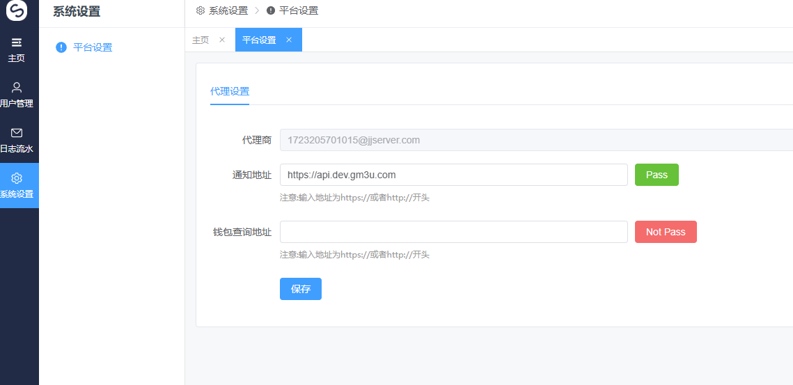

# 系统设置

该页面功能主要用于设置回调地址,请符合地址要求格式http:// 或者https:// 该地址为post

通知地址:为每次Spin后通知代理服务器的地址,这里会有标准回复参数详情请看 [<回调说明>](../api/hui-tiao-shuo-ming.md)

<figure><figcaption></figcaption></figure>


<mark style="color:orange;">填入回调地址,如果该地址不通则会显示红色,如果该地址是通的刷新页面后会是绿色</mark>

